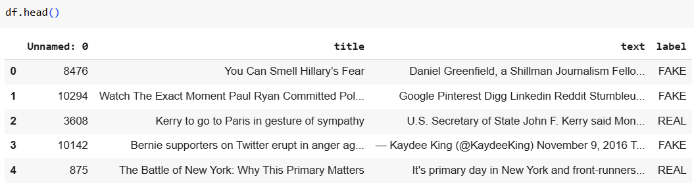
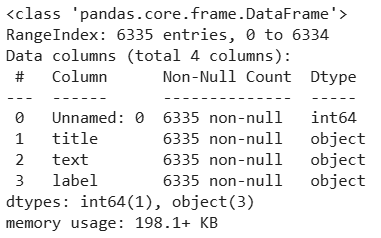
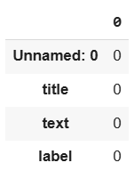
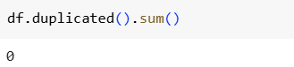
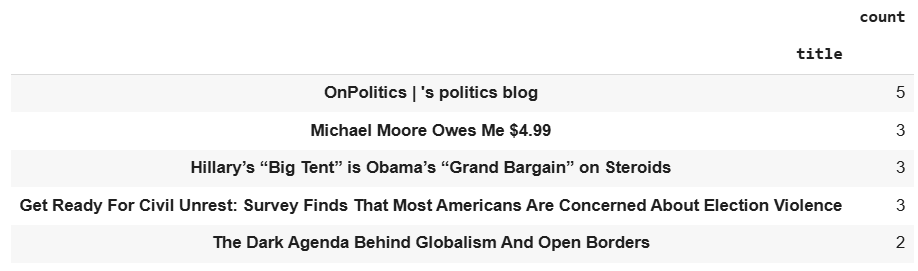
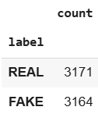
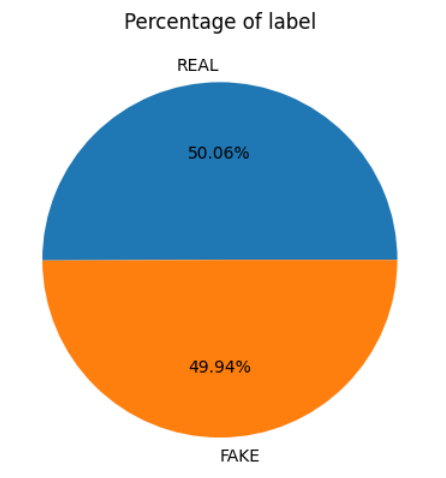

<h1>Fake News Detector</h1>
<h2>Background</h2>

Fake news refers to false or misleading information disseminated as news, often with the intent of influencing public opinion, gaining specific advantages, or damaging the reputation of an individual or group. It can take the form of completely fabricated stories, partially true information that is distorted to be misleading, or news presented out of its original context.

Due to the frequent spread of fake news, a machine learning model has been developed and made accessible to the public to help reduce trust in misleading information.

Fake News Detector is a website that leverages a machine learning model to automatically determine whether a news article is genuine or fake.

<h2>Objectives</h2>

    <ul>
        <li>Detect and identify fake news.</li>
        <li>Develop AI technology for text analysis.</li>
        <li>Prevent the spread of misinformation and disinformation.</li>
        <li>Enhance digital literacy and public awareness.</li>
        <li>Filter content on news platforms.</li>
        <li>Support high-quality and credible journalism.</li>
        <li>Reduce the influence of propaganda and political manipulation.</li>
    </ul>

<h2>Dataset</h2>
<ul>
    <li>Dataset Source: Kaggle Link: <a href="https://www.kaggle.com/datasets/rajatkumar30/fake-news">https://www.kaggle.com/datasets/rajatkumar30/fake-news</a></li>
    <li>Data Understanding The dataset consists of four columns:
        <ul>
            <li>'Unnamed: 0' – Undefined and does not contribute to the analysis.</li>
            <li>'title' – Contains the news headline.</li>
            <li>'text' – The main content of the news article.</li>
            <li>'label' – Indicates the type of news, categorized as <b>REAL</b> or <b>FAKE</b>.</li>
        </ul>
    </li>
</ul>
<h2>Tools, IDE and Dataset Source</h2>
<ul>
    <li>Python</li>
    <li>Google Colab</li>
    <li>Visual Studio Code</li>
    <li>CSV</li>
    <li>Dataset Source: Kaggle</li> 
    
    

</ul>
<h2>Library</h2>
<ul>
    <li>Data Manipulation</li>
        <ul>
            <li>Pandas</li>
            <li>Numpy</li>
        </ul>
    <li>Data Visualization</li>
        <ul>
            <li>Matplotlib</li>
            <li>Seaborn</li>
            <li>WordCloud</li>
        </ul>
    <li>Data Preprocessing</li>
        <ul>
            <li>re</li>
            <li>nktk</li>
            <li>TfidfVectorizer</li>
            <li>train_test_split</li>
            <li>text_tokenize</li>
        </ul>
    <li>Modelling</li>
        <ul>
            <li>MultinomialNB (Algoritma Naive Bayes)</li>
            <li>RandomForestClassifier (Algoritma Random Forest)</li>
            <li>KNeighborsClassifier (Algoritma k-Nearest Neighbors/KNN)</li>
            <li>LogisticRegression (Algoritma Logistic Regression)</li>
            <li>SVC (Algoritma Support Vector Classification)</li>
        </ul>
    <li>Model Evaluation</li>
        <ul>
            <li>confusion_matrix</li>
            <li>classification_report</li>
        </ul>
    <li>Model Optimization</li>
        <ul>
            <li>GridSearchCV</li>
        </ul>
    <li>Pickle File</li>
        <ul>
            <li>pickle</li>
        </ul>
</ul>

<h2>Exploratory Data Analysis (EDA)</h2>
<ul>
    <li>View Dataset  
        
        <ul>
            <li>The dataset consists of four columns:
            <ul>
                <li>'Unnamed: 0' – Undefined and does not contribute to the analysis.</li>
                <li>'title' – Contains the news headline.</li>
                <li>'text' – The main content of the news article.</li>
                <li>'label' – Indicates the type of news, categorized as <b>REAL</b> or <b>FAKE</b>.</li>
            </ul>
            </li>
        </ul>
    </li>
    <li>Check for Dataset Information  
        
        
The dataset consists of 6,335 rows and 4 columns, with the following data types:

        <ul>
            <li>1 numerical column: 'Unnamed: 0' (Undefined and not useful for analysis)</li>
            <li>3 categorical columns:
                <ul>
                    <li>'title' (News headline)</li>
                    <li>'text' (News content)</li>
                    <li>'label' (Category: REAL or FAKE)</li>
                </ul>
            </li>
        </ul>
    </li>
    <li>Check for Missing Values 
        
         The dataset is complete, with no missing values in any of the columns.
    </li>
    <li>Check for Duplicate Data 
        
         The dataset contains no duplicate records, ensuring the integrity and uniqueness of the data.
    </li>
    <li>Check for Top 5 Topic in Dataset 
        
         The most frequently discussed topic in this dataset is political news.
    </li>
    <li>Count Label and View Label Percentage with Pie Chart 
         
        
         The dataset consists of 3,171 REAL news articles (50.06%) and 3,164 FAKE news articles (49.94%). From this visualization, we can conclude that the dataset is balanced, meaning there is no need for imbalance handling during model training.
    </li>
    <li></li>
    <li></li>
    <li></li>
    <li></li>
    <li></li>
    <li></li>
</ul>
