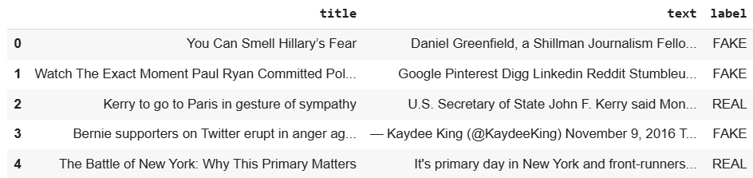
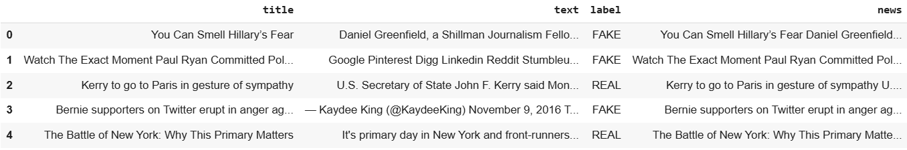
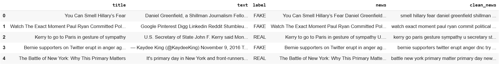
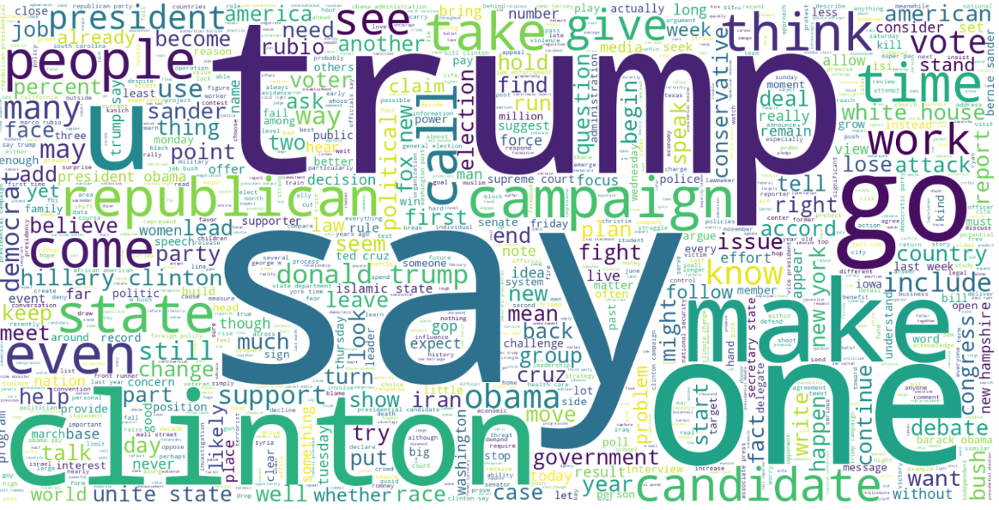
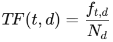
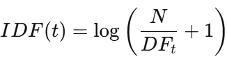
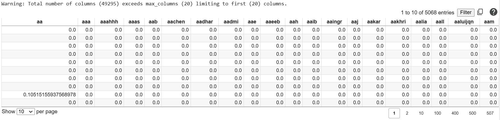

<h1>Fake News Detector</h1>
<h2>Objective</h2>

Fake news refers to false or misleading information disseminated as news, often with the intent of influencing public opinion, gaining specific advantages, or damaging the reputation of an individual or group. It can take the form of completely fabricated stories, partially true information that is distorted to be misleading, or news presented out of its original context.

Due to the frequent spread of fake news, a machine learning model has been developed and made accessible to the public to help reduce trust in misleading information.

Fake News Detector is a website that leverages a machine learning model to automatically determine whether a news article is genuine or fake.

Objective of this project is:
    <ul>
        <li>Detect and identify fake news.</li>
        <li>Develop AI technology for text analysis.</li>
        <li>Prevent the spread of misinformation and disinformation.</li>
        <li>Enhance digital literacy and public awareness.</li>
        <li>Filter content on news platforms.</li>
        <li>Support high-quality and credible journalism.</li>
        <li>Reduce the influence of propaganda and political manipulation.</li>
    </ul>

<h2>Dataset</h2>
<ul>
    <li>Dataset Source: Kaggle Link: <a href="https://www.kaggle.com/datasets/rajatkumar30/fake-news">https://www.kaggle.com/datasets/rajatkumar30/fake-news</a></li>
    <li>Data Understanding The dataset consists of four columns:
        <ul>
            <li>'Unnamed: 0' – Undefined and does not contribute to the analysis.</li>
            <li>'title' – Contains the news headline.</li>
            <li>'text' – The main content of the news article.</li>
            <li>'label' – Indicates the type of news, categorized as <b>REAL</b> or <b>FAKE</b>.</li>
        </ul>
    </li>
</ul>
<h2>Tools, IDE and Dataset Source</h2>
<ul>
    <li>Python</li>
    <li>Google Colab</li>
    <li>Visual Studio Code</li>
    <li>CSV</li>
    <li>Dataset Source: Kaggle</li> 
    
    

</ul>
<h2>Library</h2>
<ul>
    <li>Data Manipulation</li>
        <ul>
            <li>Pandas</li>
            <li>Numpy</li>
        </ul>
    <li>Data Visualization</li>
        <ul>
            <li>Matplotlib</li>
            <li>Seaborn</li>
            <li>WordCloud</li>
        </ul>
    <li>Data Preprocessing</li>
        <ul>
            <li>re</li>
            <li>nltk</li>
            <li>TfidfVectorizer</li>
            <li>train_test_split</li>
            <li>text_tokenize</li>
        </ul>
    <li>Modelling</li>
        <ul>
            <li>MultinomialNB (Algoritma Naive Bayes)</li>
            <li>RandomForestClassifier (Algoritma Random Forest)</li>
            <li>KNeighborsClassifier (Algoritma k-Nearest Neighbors/KNN)</li>
            <li>LogisticRegression (Algoritma Logistic Regression)</li>
            <li>SVC (Algoritma Support Vector Classification)</li>
        </ul>
    <li>Model Evaluation</li>
        <ul>
            <li>confusion_matrix</li>
            <li>classification_report</li>
        </ul>
    <li>Model Optimization</li>
        <ul>
            <li>GridSearchCV</li>
        </ul>
    <li>Pickle File</li>
        <ul>
            <li>pickle</li>
        </ul>
</ul>

<h2>Exploratory Data Analysis (EDA)</h2>
<ul>
    <li>View Dataset  
        
        <ul>
            <li>The dataset consists of four columns:
            <ul>
                <li>'Unnamed: 0' – Undefined and does not contribute to the analysis.</li>
                <li>'title' – Contains the news headline.</li>
                <li>'text' – The main content of the news article.</li>
                <li>'label' – Indicates the type of news, categorized as <b>REAL</b> or <b>FAKE</b>.</li>
            </ul>
            </li>
        </ul>
    </li>
    <li>Check for Dataset Information  
        
        
The dataset consists of 6,335 rows and 4 columns, with the following data types:

        <ul>
            <li>1 numerical column: 'Unnamed: 0' (Undefined and not useful for analysis)</li>
            <li>3 categorical columns:
                <ul>
                    <li>'title' (News headline)</li>
                    <li>'text' (News content)</li>
                    <li>'label' (Category: REAL or FAKE)</li>
                </ul>
            </li>
        </ul>
    </li>
    <li>Check for Missing Values 
        
         The dataset is complete, with no missing values in any of the columns.
    </li>
    <li>Check for Duplicate Data 
        
         The dataset contains no duplicate records, ensuring the integrity and uniqueness of the data.
    </li>
    <li>Check for Top 5 Topic in Dataset 
        
         The most frequently discussed topic in this dataset is political news.
    </li>
    <li>Count Label and View Label Percentage with Pie Chart 
         
        
         The dataset consists of 3,171 REAL news articles (50.06%) and 3,164 FAKE news articles (49.94%). From this visualization, we can conclude that the dataset is balanced, meaning there is no need for imbalance handling during model training.
    </li>
</ul>
<h2>Data Preprocessing</h2>
<ul>
    <li>The dataset was copied to facilitate data preprocessing, ensuring that the original data remains intact while transformations and modifications are applied to the duplicated version.</li>
    <li>The 'Unnamed: 0' column was removed as it does not contribute to the analysis or model performance. 
     After removing the 'Unnamed: 0' column, the dataset now consists of three columns
    </li>
    <li>The 'title' and 'text' columns were merged into a new column called 'news', combining both the headline and content into a single text field for better analysis and model performance. 
    
    </li>
    <li>Text Cleaning 
        Text cleaning was performed using Punkt, Stopwords, and WordNet, which includes:
        <ul>
            <li>Punkt – Removes punctuation marks.</li>
            <li>Stopwords – Removes common words like 'the', 'and', etc that do not add meaningful context.</li>
            <li>WordNet – Performs lemmatization, converting words to their base forms for consistency.</li>
        </ul>
        This preprocessing step helps improve the quality of text data for more accurate fake news detection. 
        Text cleaning was performed using the following steps:
        <ul>
            <li>Convert to lowercase – Standardizes text by converting all characters to lowercase.</li>
            <li>Removing URLs – Deletes any links present in the text to prevent irrelevant information from affecting analysis.</li>
            <li>Replacing all non-alphabetic characters with spaces – Ensures that only meaningful words remain by removing numbers, special characters, and symbols.</li>
            <li>Tokenization – Splits text into individual words.</li>
            <li>Lemmatization – Converts words to their base form using WordNet lemmatizer (e.g., "running" → "run").</li>
            <li>Remove stopwords – Filters out common words that do not contribute to meaning (e.g., "the," "is," "and").</li>
        </ul>
        These steps enhance the dataset's quality for better fake news detection using machine learning. The cleaned text data was stored in a new column called 'clean_news', ensuring that the original 'news' column remains intact for reference. This processed data will be used for further analysis and model training.
         
    </li>
    <li>WordCloud After Cleaning Text
        <ul>
            <li>WordCloud of Real News 
                
                 The REAL news in the dataset is most likely related to U.S. politics, particularly elections, as indicated by the frequent occurrence of words such as Trump, Clinton, campaign, vote, republican, and president. This suggests that the dataset primarily focuses on political news coverage.
            </li>
            <li>WordCloud of Fake News 
                
                 Fake News tends to focus on prominent political figures, conspiracy theories, and unverified claims. Emotional and provocative words are more dominant, often aiming to shape public opinion by manipulating information. Compared to the WordCloud of REAL news, Fake News appears to be more centered on sensational claims and controversial narratives, highlighting its tendency to spread misinformation through exaggerated or misleading content.
            </li>
        </ul>
    </li>
    <li>Split Data The features and target variables are defined as follows:
        <ul>
            <li>Input Feature: 'clean_news' – The preprocessed text data.</li>
            <li>Target Variable: 'label' – Categorical values transformed into numerical labels:
                <ul>
                    <li>REAL → 0</li>
                    <li>FAKE → 1</li>
                </ul>
            </li>
        </ul>
        The dataset was split into training (80%) and testing (20%), resulting in:
        <ul>
            <li>Training Data: 5,068 samples</li>
            <li>Testing Data: 1,267 samples</li>
            This split ensures the model is trained on a sufficient amount of data while retaining enough for evaluation and performance testing.
        </ul>
    </li>
    <li>Vectorization 
        Text vectorization was performed using TF-IDF (Term Frequency-Inverse Document Frequency) Vectorizer, which transforms the 'clean_news' column into a numerical representation. This technique helps the model understand the importance of words within the dataset by assigning higher weights to significant terms while reducing the impact of commonly used words. 
        TF-IDF Formula: TF-IDF (Term Frequency-Inverse Document Frequency) is a numerical statistic used to reflect the importance of a word in a document relative to a collection of documents (corpus).
        <ul>
            <li>TF (Term Frequency)
                <ul>
                    
                    <li><i style="font-family:georgia">f<i style="font-size:10px">t,d</i></i> = Number of times term t appears in document d.</li>
                    <li><i style="font-family:georgia">N<i style="font-size:10px">d</i></i> = Total number of terms in document d.</li>
                </ul>
            </li>
            <li>IDF (Inverse Document Frequency)
                <ul>
                    
                    <li><i style="font-family:georgia">N</i> = Total number of document.</li>
                    <li><i style="font-family:georgia">DF<i style="font-size:10px">t</i></i> = Number of documents containing term t.</li>
                </ul>
            </li>
            <li>TF-IDF Score
                <ul>
                    <i style="font-family:georgia">TFIDF(t,d) = TF(t,d) * IDF(t)</i>
                </ul>
            </li>
        </ul>
        Below are the results of the text vectorization applied to the dataset. There are a total of 49,295 unique word variations extracted from 5,068 data points or documents. 
         
        The vectorization results were then exported as a pickle (.pkl) file for further use and model implementation.
    </li>
</ul>
